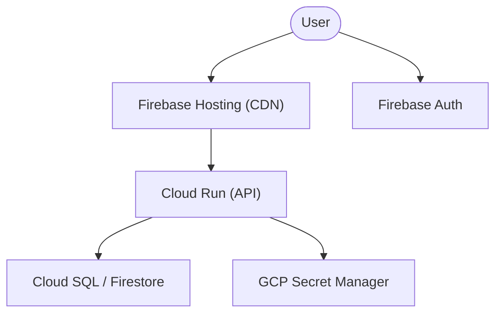

# Cloud Deployment Guide (GCP & Firebase)

This document outlines the architecture, deployment strategy, and best practices for deploying this application to Google Cloud Platform (GCP) and Firebase.

## Architecture Overview

We use a hybrid approach leveraging Firebase for frontend/identity and GCP for robust backend services.



### Components
1. **Firebase Hosting**: Serves static assets (HTML, CSS, JS) via a global CDN.
2. **Firebase Auth**: Managed identity provider for user authentication.
3. **Cloud Run**: Fully managed compute platform for running containerized API backend.
4. **Secret Manager**: Secure storage for API keys, DB credentials, and other sensitive config.
5. **Cloud SQL / Firestore**: Managed database options based on data needs.

---

## Environment Strategy

We maintain three distinct environments to ensure stability and quality.

| Environment | Trigger | Purpose |
| :--- | :--- | :--- |
| **Preview** | Pull Request | Ephemeral environments for code review. |
| **Staging** | Merge to `develop` | Integration testing and final QA. |
| **Production**| Merge to `main` | Live user environment. |

### Preview Channels (Firebase)
Every Pull Request automatically triggers a Firebase Hosting Preview Channel, providing a unique URL to test frontend changes before merging.

---

## Security Best Practices

> [!IMPORTANT]
> Never commit secrets to version control.

1. **Secret Manager**: All environment variables for Cloud Run should be sourced from Secret Manager.
2. **Workload Identity**: Use Workload Identity Federation for GitHub Actions to avoid long-lived service account keys.
3. **IAM Roles**: Adhere to the principle of least privilege. Use dedicated service accounts for Cloud Run and CI/CD.

---

## Testing & Deployment Flow

Our CI/CD pipeline ensures that no code reaches production without being verified.

1. **Local Development**: Developer runs `scripts/test-and-report.sh`.
2. **Pull Request**: GitHub Actions runs unit and integration tests.
3. **Staging**: Automated deployment to the staging environment after successful merge.
4. **Production**: Manual approval or automated deployment to production from the `main` branch.

---

## Deployment Commands

### Manual Deployment (Authorized Users Only)
```bash
# Deploy to Staging
./scripts/deploy.sh staging

# Deploy to Production
./scripts/deploy.sh production
```

> [!CAUTION]
> Always verify the staging environment before triggering a production deployment.
